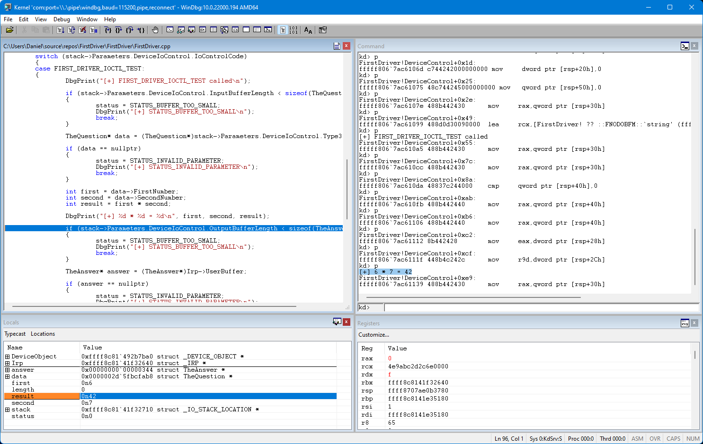

One of the coolest (in my opinion) features of WinDbg is the ability to load in custom source code and debug symbols.  Go to **File > Source File Path** and add the path to the driver source code.  For me, that's `C:\Users\Daniel\source\repos\FirstDriver\FirstDriver`.  Then **File > Symbol File Path** and add the directory that contains `FirstDriver.pdb`.  For me, that's `C:\Users\Daniel\source\repos\FirstDriver\x64\Debug`.

Break the debugger (**Debug > Break**) to activate the Command window and set a breakpoint on our **DeviceControl** function.

```
kd> bp FirstDriver!DeviceControl
kd> bl
     0 e Disable Clear  fffff807`32371050     0001 (0001) FirstDriver!DeviceControl

kd> g
```


Resume (with `F5` or the `g` command) and run the FirstDriverClient.  When the breakpoint is hit, WinDbg will display the driver source code and the current 'location' of the code execution.





Use `F10` to step over each instruction and you will see how this behaves like a standard managed debugger.  Select **View > Locals** to view and browse variables within the current scope.  For me, this makes driver debugging much more familiar and less intimidating.