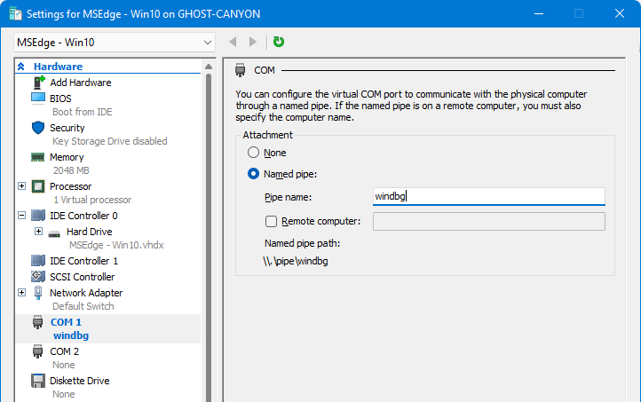
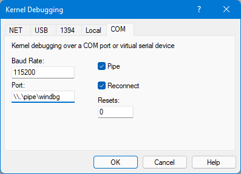
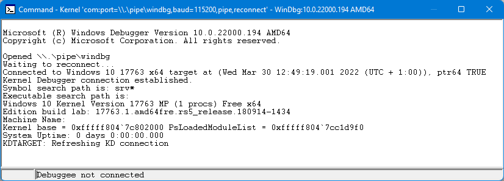

The easiest way to build and test drivers is via a hypervisor that supports kernel debugging.  I use my physical Windows host to write and build the driver, and another Windows host running virtually in Hyper-V to load and test it.  Hyper-V allows the physical host to attach a debugger to the virtual host via a COM port to inspect memory etc, and crashing a VM is far less hassle than crashing your host.

Before being able to write a driver, head to the [Windows Driver Kit](https://docs.microsoft.com/en-us/windows-hardware/drivers/download-the-wdk) (WDK) page and follow the steps outlined on your host/dev machine:

- Install Visual Studio 2022 and select the **Desktop development with C++** workload.
- Install the Windows 11 SDK.
- Install the Windows 11 WDK.


The WDK install should prompt you to install the associated Visual Studio extension, to which you should do.


If it does not, install it manually by browsing to `C:\Program Files (x86)\Windows Kits\10\Vsix\VS2022\10.x` and double-clicking on `WDK.vsix`.

- Finally, install [WinDbg Preview](https://docs.microsoft.com/en-us/windows-hardware/drivers/debugger/debugger-download-tools).


If you need a virtual Windows image, you can grab the 'MSEdge on Win10 1809' VM from https://developer.microsoft.com/en-us/microsoft-edge/tools/vms/.  Once imported, modify one of the COM ports to expose its communication over a named pipe (the name can be anything you want).

> **Note**:  If you're building your own VM from an ISO, make sure to configure it as **Generation 1**.





Power the VM on, open an elevated Command Prompt window and enter the following commands:

```
C:\>bcdedit /debug on
The operation completed successfully.

C:\>bcdedit /dbgsettings serial debugport:1 baudrate:115200
The operation completed successfully.

C:\>bcdedit /set testsigning on
The operation completed successfully.
```


BCDEDIT is the Boot Configuration Data Store Editor which can modify the boot configuration for Windows.  The first command enables kernel debugging and the second command configures the debug parameters.  The `debugport` number should correspond to the COM port number we configured with the named pipe.  The third command permits Windows to load test-signed drivers (which is disabled by default).

Next, open regedit (also in an elevated context) and navigate to `HKLM\SYSTEM\CurrentControlSet\Control\Session Manager`.  Create a new Key called **Debug Print Filter** and within that, a new DWORD Value.  Give it the name **DEFAULT** and a value of **8**.  This will allow Windows to generate kernel debug messages, which are disabled by default.

Finally, open WinDbg on your host and select **File > Kernel Debug** (or use `Ctrl+K`).  In the connection window, select the **COM** tab.  Tick the **Pipe** button and in the **Port** text box, enter the named pipe name (`\\.\pipe\windbg`) in my case.




Click **OK** and then reboot the VM.  As it boots back up, you should see WinDbg attach to it.




You can stop the kernel by selecting **Debug > Break**.

```
Break instruction exception - code 80000003 (first chance)
*******************************************************************************
*                                                                             *
*   You are seeing this message because you pressed either                    *
*       CTRL+C (if you run console kernel debugger) or,                       *
*       CTRL+BREAK (if you run GUI kernel debugger),                          *
*   on your debugger machine's keyboard.                                      *
*                                                                             *
*                   THIS IS NOT A BUG OR A SYSTEM CRASH                       *
*                                                                             *
* If you did not intend to break into the debugger, press the "g" key, then   *
* press the "Enter" key now.  This message might immediately reappear.  If it *
* does, press "g" and "Enter" again.                                          *
*                                                                             *
*******************************************************************************
nt!DbgBreakPointWithStatus:
fffff804`7c9bd240 cc              int     3
```


You will notice the entire VM freeze and Hyper-V will even lose its connection.  This is why you cannot fully debug a local kernel, the whole machine state is suspended by the debugger.  To allow the system to continue, select **Debug > Go** or **F5**.  After which, the VM will start responding again.


If you have a Linux host rather than Windows, you can set up two Windows VMs instead.  [This short post](https://github.com/xalicex/kernel-debug-lab-for-virtual-box) provides instructions on how to set up kernel debugging with VirtualBox.