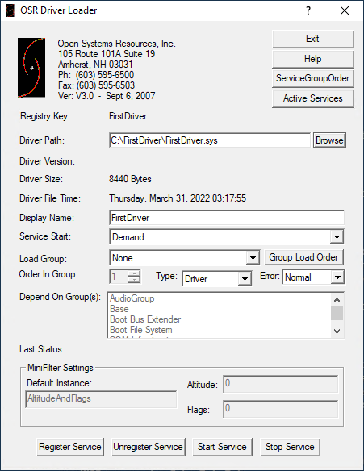
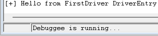

Build the driver and copy the entire contents of the Debug directory (`C:\Path\to\FirstDriver\x64\Debug`) to your VM (such as `C:\FirstDriver`).

There are two main methods to load a driver.  The first is using the native `sc.exe` command-line tool.

```
C:\>sc create FirstDriver type= kernel binPath= C:\FirstDriver\FirstDriver.sys
[SC] CreateService SUCCESS
```


This will register a Service that you can also read back (notice the type **KERNEL_DRIVER**).

```
C:\>sc qc FirstDriver
[SC] QueryServiceConfig SUCCESS

SERVICE_NAME: FirstDriver
        TYPE               : 1  KERNEL_DRIVER
        START_TYPE         : 3   DEMAND_START
        ERROR_CONTROL      : 1   NORMAL
        BINARY_PATH_NAME   : \??\C:\FirstDriver\FirstDriver.sys
        LOAD_ORDER_GROUP   :
        TAG                : 0
        DISPLAY_NAME       : FirstDriver
        DEPENDENCIES       :
        SERVICE_START_NAME :
```


It will also be registered under `HKLM\SYSTEM\CurrentControlSet\Services\FirstDriver`.

You can then start the driver using `sc start`.

```
C:\Windows\system32>sc start FirstDriver

SERVICE_NAME: FirstDriver
        TYPE               : 1  KERNEL_DRIVER
        STATE              : 4  RUNNING
                                (STOPPABLE, NOT_PAUSABLE, IGNORES_SHUTDOWN)
        WIN32_EXIT_CODE    : 0  (0x0)
        SERVICE_EXIT_CODE  : 0  (0x0)
        CHECKPOINT         : 0x0
        WAIT_HINT          : 0x0
        PID                : 0
        FLAGS              :
```


Another popular tool is the [OSR Driver Loader](https://www.osronline.com/article.cfm^article=157.htm). It does the same thing as sc but in a nice GUI.





Once the driver has started, you should see the appropriate output in WinDbg.





When testing new versions of the driver, it's not necessary to fully delete the associated service.  Simply stop the service, replace the driver files and start the service again.