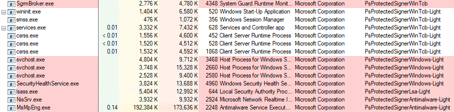

Protected Processes were first introduced in Windows Vista - not for security, but DRM (Digital Rights Management).  The idea was to allow media players to read Blu-rays, but not copy the content.  It worked fundamentally by limiting the access you could obtain to a protected process, such as PROCESS_QUERY_LIMITED_INFORMATION or PROCESS_TERMINATE, but not PROCESS_VM_READ or anything else that would allow you to circumvent the DRM requirements.

Tools such as [Process Explorer](https://docs.microsoft.com/en-us/sysinternals/downloads/process-explorer) can display the protection level of a process.



The impact of this is most notable when [applied](https://docs.microsoft.com/en-us/windows-server/security/credentials-protection-and-management/configuring-additional-lsa-protection) to LSASS.  We cannot dump passwords from it, even when running as SYSTEM.  We get access denied when trying to obtain a handle with enough privileges to query and read its memory.  This is not an AV or EDR protection - simply the Windows kernel.


```
  .#####.   mimikatz 2.2.0 (x64) #19041 Aug 10 2021 02:01:23
 .## ^ ##.  "A La Vie, A L'Amour" - (oe.eo)
 ## / \ ##  /*** Benjamin DELPY `gentilkiwi` ( benjamin@gentilkiwi.com )
 ## \ / ##       > https://blog.gentilkiwi.com/mimikatz
 '## v ##'       Vincent LE TOUX             ( vincent.letoux@gmail.com )
  '#####'        > https://pingcastle.com / https://mysmartlogon.com ***/

mimikatz # privilege::debug
Privilege '20' OK

mimikatz # sekurlsa::logonpasswords
ERROR kuhl_m_sekurlsa_acquireLSA ; Handle on memory (0x00000005)
```


Since Vista, Protected Processes have been expanded.  Instead of it simply being on or off, there are now hierarchical levels.  First - there are two possible types, **Protected Process (PP)** and **Protected Process Light (PPL)**.  Second - there is also a **Signer**, which comes from the Extended Key Usage field of the digital signature used to sign the executable.

If we look at lsass.exe for example, we can see the certificate used to sign it has PPL verification enabled in the EKU.


The [documented](https://docs.microsoft.com/en-us/windows/win32/procthread/zwqueryinformationprocess) _PS_PROTECTED_SIGNER struct provides a view of the possible signers that can be used.

Because of these various moving parts, there is an order of protection precedence that the kernel considers.  PP always trumps PPL.  So a PPL can never obtain full access to a PP, regardless of its signer.  A PP can gain full access to another PP or PPL if the signer is equal or greater, and a PPL can gain full access to another PPL if the signer is equal to or greater.

This makes sense because even though you want to protect a process like LSASS, other (more privileged) services still need access to it for it to function correctly.

