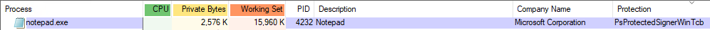
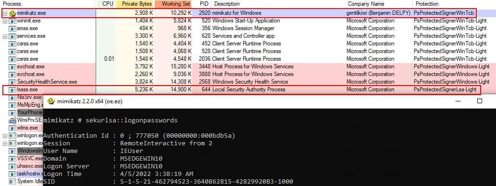

You may also protect an arbitrary process in much the same way.  The in-memory values will already be all 0, so we can just set them to whatever we want (as long as they're valid).  For instance, to protect a process as **PsProtectedSignerWinTcb**, we could do:

```
psProtection->SignatureLevel = 30;
psProtection->SectionSignatureLevel = 28;
psProtection->Protection.Type = 2;
psProtection->Protection.Signer = 6;
```





Protecting a process means that it can't (easily) be forcefully killed via Task Manager etc.  Or, in a scenario where we wanted to dump LSASS, we could simply protect our executable (e.g. Mimikatz) to have a higher protection level than PsProtectedSignerLsa-Light.


