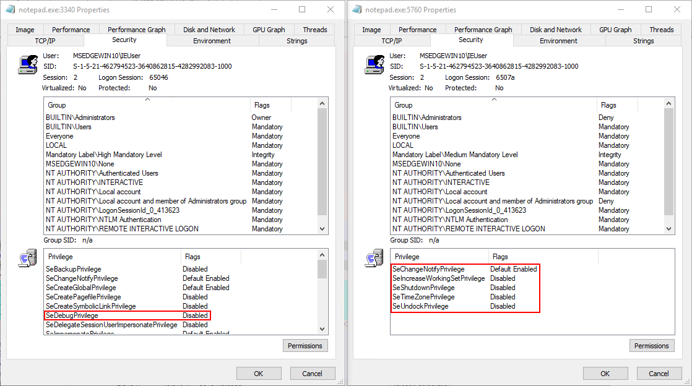

Process privilege determines the type of operations that a process can perform.  A process running in medium integrity (right) has very few privileges available; whereas a process running in high integrity (left) has more.  Some privileges are **Default Enabled**, which means they are enabled by default (duh).  Others are **Disabled** but are available, which means they can be enabled using the [AdjustTokenPrivileges](https://docs.microsoft.com/en-us/windows/win32/api/securitybaseapi/nf-securitybaseapi-adjusttokenprivileges) API.

Take SeDebugPrivilege as an example.  The high integrity process has it disabled but available (the `token::elevate` command in Mimikatz enables this privilege).  The medium integrity process cannot enable it at all.

 The [Privilege Constants documentation](https://docs.microsoft.com/en-us/windows/win32/secauthz/privilege-constants) provides a description of what each privilege does.