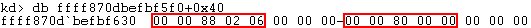

The token of a process is stored within its EPROCESS structure, under the **Token** attribute.  

```
kd> dt nt!_EPROCESS
   +0x358 Token            :_EX_FAST_REF
```


EX_FAST_REF is a type of [pointer](https://codemachine.com/articles/exfastref_pointers.html) which, in this case, points to a **TOKEN** structure.  It's quite large, but the **Privileges** attribute is the one we're interested in.

```
kd> dt nt!_TOKEN
   +0x040 Privileges       : _SEP_TOKEN_PRIVILEGES
```


This attribute points to another structure called **SEP_TOKEN_PRIVILEGES**.

```
kd> dt nt!_SEP_TOKEN_PRIVILEGES
   +0x000 Present          : Uint8B
   +0x008 Enabled          : Uint8B
   +0x010 EnabledByDefault : Uint8B
```


Here we see the familiar fields of Present (or available), Enabled and EnabledByDefault.

To actually get a view of the memory region, use the **!process** command to list a short summary of every running process (warning, it's a bit slow).

```
kd> !process 0 0
[...snip...]

PROCESS ffffb60f81c4b2c0
    SessionId: 2  Cid: 0d0c    Peb: afdd29e000  ParentCid: 0a60
    DirBase: 55f81000  ObjectTable: ffff870dbf75e240  HandleCount: 233.
    Image: notepad.exe
```


**ffffb60f81c4b2c0** is the address of EPROCESS for this process.  `!process <address> 1` will give a bit more information, including the memory location of the token structure (**ffff870dbc150060**).

```
kd> !process ffffb60f81c4b2c0 1
PROCESS ffffb60f81c4b2c0
    SessionId: 2  Cid: 0d0c    Peb: afdd29e000  ParentCid: 0a60
    DirBase: 55f81000  ObjectTable: ffff870dbf75e240  HandleCount: 233.
    Image: notepad.exe
    VadRoot ffffb60f835d27c0 Vads 95 Clone 0 Private 555. Modified 1. Locked 0.
    DeviceMap ffff870dbbcf1130
    Token                             ffff870dbc150060
    ElapsedTime                       00:16:32.761
    UserTime                          00:00:00.000
    KernelTime                        00:00:00.000
    QuotaPoolUsage[PagedPool]         263616
    QuotaPoolUsage[NonPagedPool]      13440
    Working Set Sizes (now,min,max)  (4064, 50, 345) (16256KB, 200KB, 1380KB)
    PeakWorkingSetSize                3979
    VirtualSize                       2101418 Mb
    PeakVirtualSize                   2101424 Mb
    PageFaultCount                    4145
    MemoryPriority                    BACKGROUND
    BasePriority                      8
    CommitCharge                      643
```


We can read the bytes at this address, plus the 0x40 offset.





It's not super-clear, but these are bitmask that can be anything from 0x00 to 0xff, and different combinations will enable different privileges.