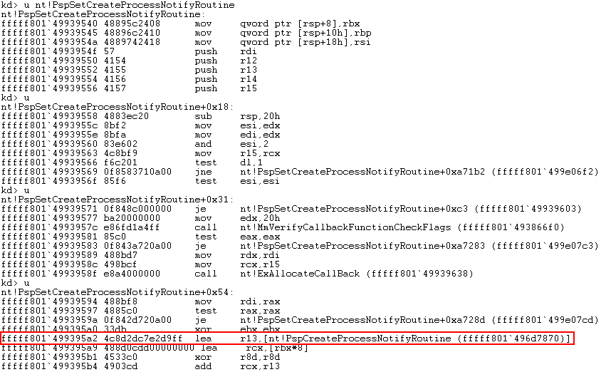
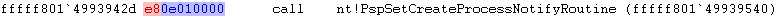

When a driver registers a ProcessNotify callback, it gets stored inside an in-memory array called **PspCreateProcessNotifyRoutine**.  Each callback has it's own version (e.g. PspCreateThreadNotifyRoutine for PsSetCreateThreadNotifyRoutine).  These arrays have a maximum size of 64 and each index contains a pointer to a callback function.  In all likelihood, these callbacks exist inside the module that registered it.

Unfortunately, there's no native API to get a pointer to these arrays.  Instead, we have to find them in memory using WinDbg and calculate an offset from something that we can look up dynamically at runtime.  As with the process protection offset in EPROCESS, these will be different across different Windows versions.

We can start by looking at the actual **PsSetCreateProcessNotifyRoutine** function.

```
kd> u nt!PsSetCreateProcessNotifyRoutine
nt!PsSetCreateProcessNotifyRoutine:
fffff801`49939420 4883ec28        sub     rsp,28h
fffff801`49939424 8ac2            mov     al,dl
fffff801`49939426 33d2            xor     edx,edx
fffff801`49939428 84c0            test    al,al
fffff801`4993942a 0f95c2          setne   dl
fffff801`4993942d e80e010000      call    nt!PspSetCreateProcessNotifyRoutine (fffff801`49939540)
fffff801`49939432 4883c428        add     rsp,28h
fffff801`49939436 c3              ret
```


Pretty quickly we see there's a **call** instruction to **nt!PspSetCreateProcessNotifyRoutine**.  The address of which is **0xFFFFF80149939540**.

> **Note**: This may be a **jmp** instruction on other Windows versions and the actual memory addresses will be different on each reboot.


Unassemble this function until you see the first **lea** instruction.





LEA is short for Load Effective Address.  This instruction is moving the address of the **PspCreateProcessNotifyRoutine** array into the **R13** CPU register.  Again, we can see the address is **0xFFFFF801496d7870**.

> **Note**: Another version of Windows may use a different register.


Dumping this address, we can see the various callback pointers that have been registered.

```
kd> dqs fffff801`496d7870
fffff801`496d7870  ffffb105`5885275f
fffff801`496d7878  ffffb105`589d8eaf
fffff801`496d7880  ffffb105`58de8e1f
fffff801`496d7888  ffffb105`58de8d5f
fffff801`496d7890  ffffb105`5a0e55af
fffff801`496d7898  ffffb105`5a13b46f
fffff801`496d78a0  ffffb105`5a13baff
fffff801`496d78a8  ffffb105`5a13b9df
fffff801`496d78b0  ffffb105`5a2ac72f
fffff801`496d78b8  ffffb105`5b4f870f
fffff801`496d78c0  00000000`00000000
fffff801`496d78c8  00000000`00000000
fffff801`496d78d0  00000000`00000000
fffff801`496d78d8  00000000`00000000
fffff801`496d78e0  00000000`00000000
fffff801`496d78e8  00000000`00000000
```


In this example, there are 10 callbacks present, and the other entries are empty.  We can confirm this is the correct spot by registering a callback from a driver of our own.

```
kd> dps (ffffb105`5b4f870f & fffffffffffffff8) L1
ffffb105`5b4f8708  fffff801`4e991020 NotSysmon!OnProcessNotify [C:\Users\Daniel\source\repos\NotSysmon\NotSysmon\NotSysmon.cpp @ 34]
```


The value ffffb105`5b4f870f is not a pointer here, it's a handle.  We have to AND it with fffffffffffffff8 to get the raw pointer.  [This post](https://codemachine.com/articles/kmdf_handles_and_pointers.html) explains it in more detail.  Before we go any further, we need a method to hunt for this address in our driver.  I will put this in its own method.

```
ULONG64 FindPspSetCreateProcessNotify(WINDOWS_VERSION WindowsVersion)
```


First, we need to find the memory location of PsSetCreateThreadNotifyRoutine, which we can do with the [MmGetSystemRoutineAddress](https://docs.microsoft.com/en-us/windows-hardware/drivers/ddi/wdm/nf-wdm-mmgetsystemroutineaddress) API.  From there we walk memory and look for the call (or jmp) instruction.  The opcode for **call** is **0xE8** and **0xE9** for **jmp.**

```
ULONG64
FindPspSetCreateProcessNotify(
	WINDOWS_VERSION WindowsVersion)
{
	UNICODE_STRING functionName;
	RtlInitUnicodeString(&functionName, L"PsSetCreateProcessNotifyRoutine");

	ULONG64 psSetCreateProcessNotify = 0;
	psSetCreateProcessNotify = (ULONG64)MmGetSystemRoutineAddress(&functionName);

	if (psSetCreateProcessNotify == 0)
	{
		KdPrint(("[!] Failed to find PsSetCreateProcessNotifyRoutine\n"));
		return 0;
	}

	KdPrint(("[+] PsSetCreateProcessNotifyRoutine found @ 0x%llX\n", psSetCreateProcessNotify));

	// Search for CALL/JMP
	ULONG64	i = 0;
	for (i = psSetCreateProcessNotify; i < psSetCreateProcessNotify + 0x14; i++)
	{
		if ((*(PUCHAR)i == PSP_OPCODE[WindowsVersion]))
		{
			KdPrint(("[+] CALL/JMP found @ 0x%llX\n", i));
		}
	}
}
```


My **PSP_OPCODE** array is identical in design to the previous example of PROCESS_PROTECTION_OFFSET.

```
const UCHAR OPCODE_CALL = 0xE8;
const UCHAR OPCODE_JMP = 0xE9;

const UCHAR PSP_OPCODE[] =
{
    0x00,           // placeholder
    0x00,           // placeholder
    0x00,           // placeholder
    0x00,           // placeholder
    0x00,           // placeholder
    OPCODE_CALL,    // REDSTONE_5
    0x00,           // placeholder
    0x00,           // placeholder
    0x00,           // placeholder
    0x00,           // placeholder
    0x00            // placeholder
};
```


When I reach the target instruction, **i** is at **0xFFFFF8014993942D**, which unsurprisingly is on **E8** (highlighted red).  The bytes highlighted in blue are a relative offset to the address that the call instruction is operating on.





If we do the maths manually, our current position is **0xFFFFF8014993942D**, plus **10E** only comes to **0xFFFFF8014993953B** and not **0xFFFFF80149939540**.  There's a difference of just **5**.  This could be accounted for due to the fact **i** is currently sitting at the start of the call instruction and not the end.

```
LONG offset = 0;
ULONG64	i = 0;
ULONG64 pspSetCreateProcessNotify = 0;

for (i = psSetCreateProcessNotify; i < psSetCreateProcessNotify + 0x14; i++)
{
	if ((*(PUCHAR)i == PSP_OPCODE[WindowsVersion]))
	{
		KdPrint(("[+] CALL/JMP found @ 0x%llX\n", i));
		RtlCopyMemory(&offset, (PUCHAR)(i + 1), 4);
		pspSetCreateProcessNotify = i + offset + 5;
		break;
	}
}

if (pspSetCreateProcessNotify == 0)
{
	KdPrint(("[+] Failed to find PspSetCreateProcessNotifyRoutine\n"));
	return 0;
}

KdPrint(("[+] PspSetCreateProcessNotifyRoutine found @ 0x%llX\n", pspSetCreateProcessNotify));
```


Once we have the memory address of PspSetCreateProcessNotifyRoutine, we have to find the LEA instruction.  The process is the same, so doesn't require any additional explanation.

```
// Search for LEA
offset = 0;
for (i = pspSetCreateProcessNotify; i < pspSetCreateProcessNotify + 0x64; i++)
{
	if ((*(PUCHAR)i == OPCODE_LEA))
	{
		KdPrint(("[+] LEA found @ 0x%llX\n", i));
		RtlCopyMemory(&offset, (PUCHAR)(i + 2), 4);

		ULONG64 pArray = i + offset + 6;
		KdPrint(("[+] PspSetCreateProcessNotifyRoutine array found @ 0x%llX\n", pArray));
		return pArray;
	}
}
```


```
[+] PsSetCreateProcessNotifyRoutine found @ 0xFFFFF80149939420
[+] CALL/JMP found @ 0xFFFFF8014993942D
[+] PspSetCreateProcessNotifyRoutine found @ 0xFFFFF80149939540
[+] LEA found @ 0xFFFFF801499395A3
[+] PspSetCreateProcessNotifyRoutine array found @ 0xFFFFF801496D7870
```