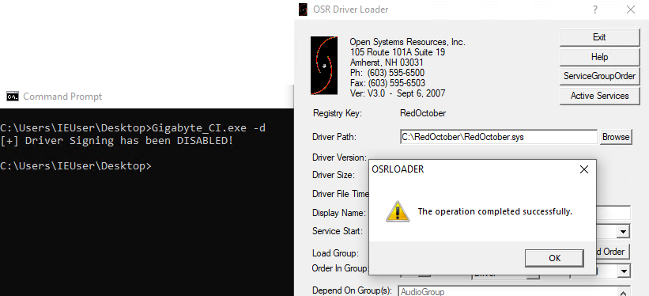
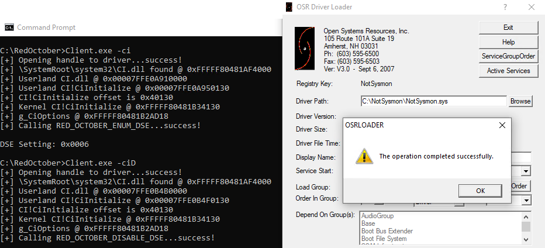

The best way to test the DSE capabilities is to disable test signing mode and leverage a legitimate driver to disable and load your driver.  You can then try disabling and re-enabling DSE from your driver.  For this, I recommend the Gigabyte driver from [CVE-2018-10320](https://github.com/rasta-mouse/CVE-2018-19320).

With DSE enabled, we're unable to load our driver.

Using the vulnerable Gigabyte driver, we can patch DSE.  Then our driver will load successfully.

We can then use our driver to re-enable DSE and verify that the NotSysmon driver won't load.  Disable DSE again with our driver and verify that NotSysmon does now load.

